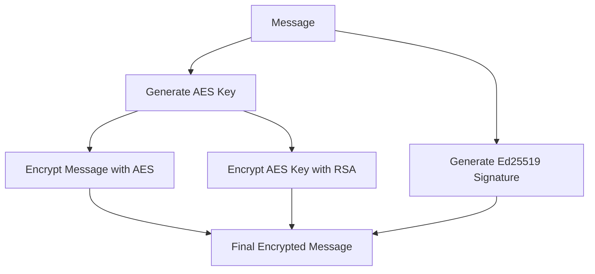

# Digital Signature System Documentation

## Table of Contents
1. [Overview](#overview)
2. [System Architecture](#system-architecture)
3. [Security Features](#security-features)
4. [Implementation Details](#implementation-details)
5. [Usage Guide](#usage-guide)
6. [API Reference](#api-reference)
7. [Best Practices](#best-practices)
8. [Troubleshooting](#troubleshooting)

## Overview

The Digital Signature System is a secure communication platform that enables users to exchange encrypted messages with cryptographic signatures. The system implements hybrid encryption (RSA + AES) and Ed25519 signatures for secure, authenticated communication.

### Key Features
- User identity management with keypairs
- Message encryption and decryption
- Digital signatures for message authenticity
- Graphical user interface
- Hybrid encryption system
- Real-time message verification

## System Architecture

### Core Components

#### 1. User Management
```rust
struct User {
    username: String,
    keypair: Keypair,        // Ed25519 keypair for signatures
    rsa_private: RsaPrivateKey,  // RSA private key for encryption
    rsa_public: RsaPublicKey,    // RSA public key for encryption
}
```
- Manages user identities
- Stores cryptographic keys
- Handles key generation

#### 2. Message Encryption
```rust
struct EncryptedMessage {
    encrypted_data: Vec<u8>,     // AES encrypted message
    signature: Signature,        // Ed25519 signature
    sender_public: PublicKey,    // Sender's public key
    symmetric_key: Vec<u8>,      // RSA encrypted AES key
    nonce: Vec<u8>,             // AES-GCM nonce
}
```
- Handles message encryption
- Manages signatures
- Stores encrypted data

#### 3. Application State
```rust
struct SignatureApp {
    users: HashMap<String, User>,
    current_user: Option<String>,
    recipient: String,
    message: String,
    encrypted_messages: Vec<(String, EncryptedMessage)>,
    decrypted_messages: Vec<(String, String)>,
    new_username: String,
}
```
- Manages application state
- Handles user interactions
- Stores messages

## Security Features

### 1. Hybrid Encryption System
The system uses a hybrid encryption approach combining:
- RSA (2048-bit) for key exchange
- AES-GCM (256-bit) for message encryption
- Ed25519 for digital signatures

#### Encryption Flow


### 2. Digital Signatures
- Uses Ed25519 for fast, secure signatures
- Ensures message authenticity
- Provides non-repudiation

### 3. Key Management
- Secure key generation using system entropy
- Separate keys for encryption and signing
- Automatic key pair generation for new users

## Implementation Details

### 1. Message Encryption Process
```rust
fn encrypt_message(&self, sender: &User, recipient: &User, message: &str) -> EncryptedMessage {
    // Generate symmetric key
    let symmetric_key = Aes256Gcm::generate_key(&mut AesOsRng);
    
    // Create cipher and encrypt
    let cipher = Aes256Gcm::new(&symmetric_key);
    let nonce = Aes256Gcm::generate_nonce(&mut AesOsRng);
    let encrypted_data = cipher.encrypt(&nonce, message.as_bytes().as_ref())
                              .expect("Encryption failed");
    
    // Sign message
    let signature = sender.keypair.sign(message.as_bytes());
    
    // Encrypt symmetric key
    let padding = PaddingScheme::new_pkcs1v15_encrypt();
    let encrypted_symmetric_key = recipient.rsa_public.encrypt(
        &mut OsRng, 
        padding, 
        &symmetric_key
    ).expect("Failed to encrypt symmetric key");
    
    EncryptedMessage {
        encrypted_data,
        signature,
        sender_public: sender.keypair.public,
        symmetric_key: encrypted_symmetric_key,
        nonce: nonce.to_vec(),
    }
}
```

### 2. Message Decryption Process
```rust
fn decrypt_message(&self, recipient: &User, message: &EncryptedMessage) -> Option<String> {
    // Decrypt symmetric key
    let padding = PaddingScheme::new_pkcs1v15_encrypt();
    let symmetric_key = recipient.rsa_private.decrypt(
        padding, 
        &message.symmetric_key
    ).ok()?;
    
    // Decrypt message
    let cipher = Aes256Gcm::new_from_slice(&symmetric_key).ok()?;
    let nonce = Nonce::from_slice(&message.nonce);
    let decrypted_data = cipher.decrypt(nonce, message.encrypted_data.as_ref()).ok()?;
    
    // Verify signature
    let decrypted_message = String::from_utf8(decrypted_data).ok()?;
    message.sender_public.verify(
        decrypted_message.as_bytes(),
        &message.signature
    ).ok()?;
    
    Some(decrypted_message)
}
```

## Usage Guide

### 1. Installation
```bash
# Clone the repository
git clone https://github.com/yourusername/digital-signature-system

# Build the project
cargo build --release

# Run the application
cargo run --release
```

### 2. Creating Users
1. Launch the application
2. Enter username in the "Create New User" field
3. Click "Create User" button
4. Repeat for additional users

### 3. Sending Messages
1. Select your user from the "Current User" dropdown
2. Choose a recipient from the "To" dropdown
3. Enter your message in the text field
4. Click "Send Encrypted Message"

### 4. Reading Messages
1. Switch to the recipient's account using the "Current User" dropdown
2. View decrypted messages in the "Received Messages" section

## API Reference

### Core Functions

#### User Creation
```rust
fn create_user(&mut self, username: String)
```
- Creates new user with keypairs
- Parameters:
  - `username`: Unique identifier for the user

#### Message Encryption
```rust
fn encrypt_message(&self, sender: &User, recipient: &User, message: &str) -> EncryptedMessage
```
- Encrypts and signs a message
- Parameters:
  - `sender`: User sending the message
  - `recipient`: Intended message recipient
  - `message`: Message content
- Returns: `EncryptedMessage` structure

#### Message Decryption
```rust
fn decrypt_message(&self, recipient: &User, message: &EncryptedMessage) -> Option<String>
```
- Decrypts and verifies a message
- Parameters:
  - `recipient`: Message recipient
  - `message`: Encrypted message
- Returns: Decrypted message if verification succeeds

## Best Practices

1. **Key Management**
   - Generate new keys for each user
   - Never share private keys
   - Regularly rotate keys (not implemented)

2. **Message Security**
   - Verify signatures before trusting messages
   - Use unique nonces for each encryption
   - Implement message expiration (future feature)

3. **User Interface**
   - Verify recipient before sending
   - Clear message field after sending
   - Regularly clear decrypted messages

## Troubleshooting

### Common Issues

1. **Message Encryption Fails**
   - Verify recipient's public key is available
   - Check message isn't empty
   - Ensure current user is selected

2. **Decryption Fails**
   - Verify private key matches
   - Check signature validation
   - Ensure message integrity

3. **UI Issues**
   - Restart application
   - Verify user creation
   - Check error messages

